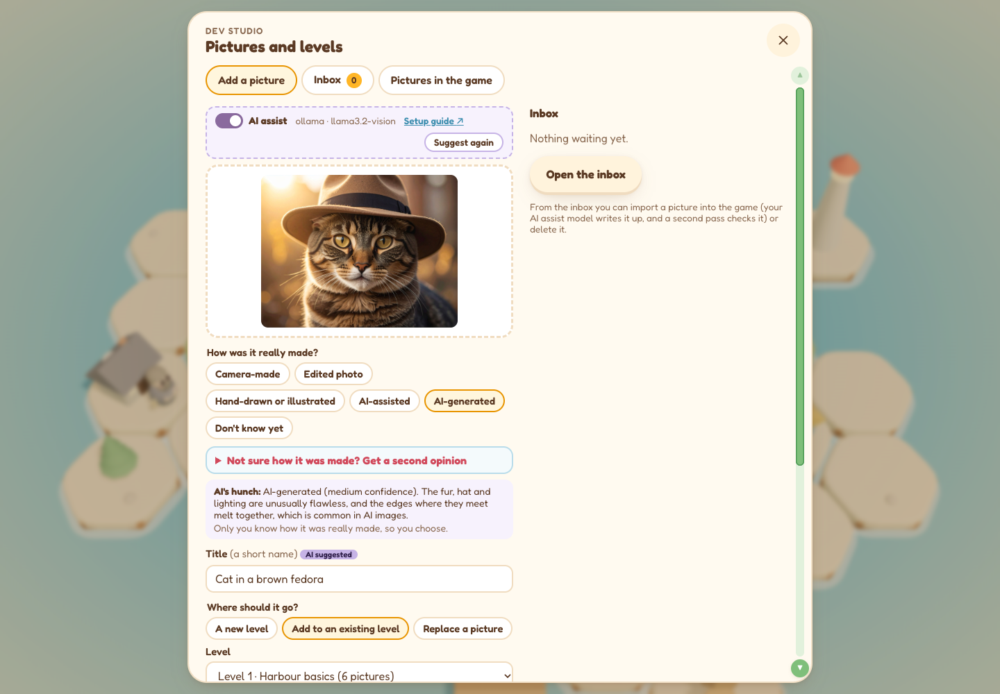
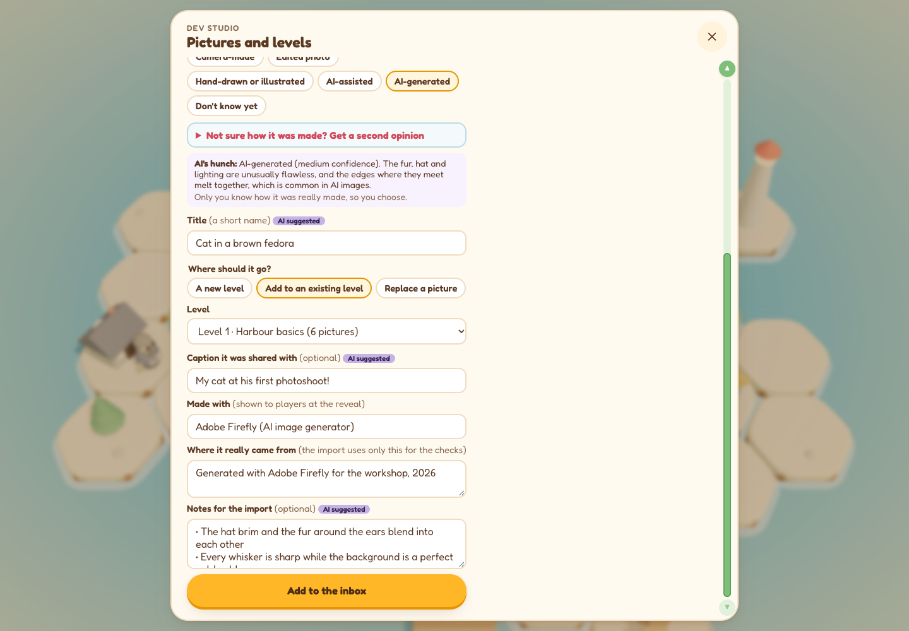
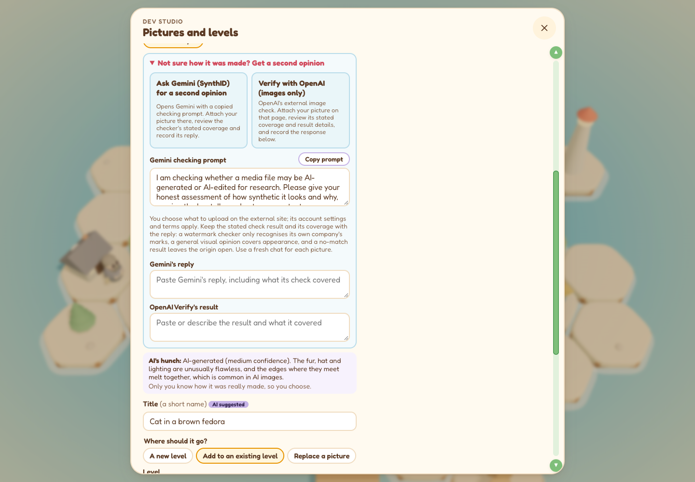
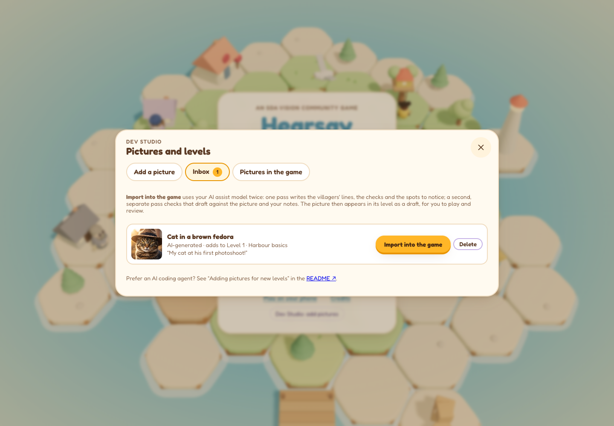
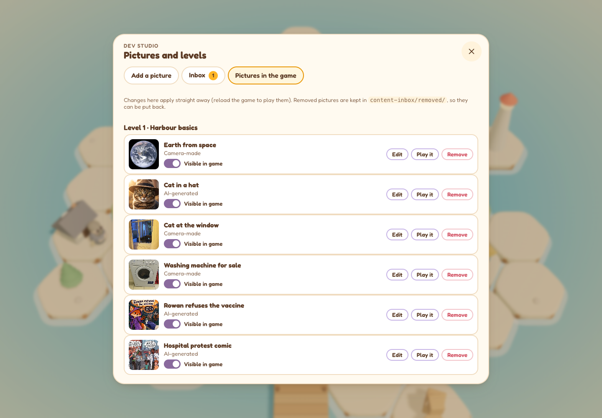
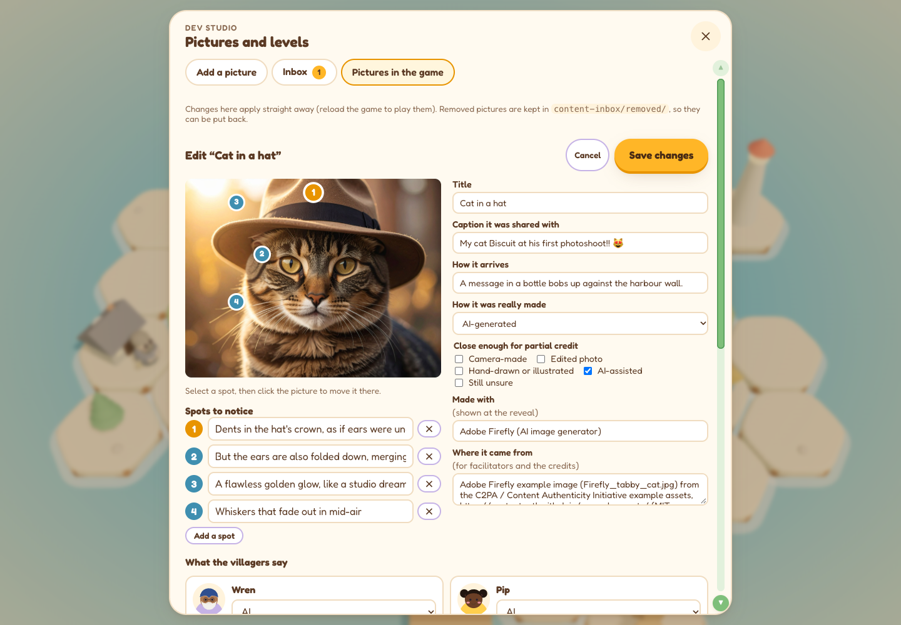

# Hearsay Harbour

[](https://doi.org/10.5281/zenodo.23237554)

**Play it in your browser:** https://synthetic-realities.github.io/hearsay-harbour/

Hearsay Harbour is a cozy island game about working out how a picture was made before you share it.
It teaches the SDA Vision community workshop method: **Notice → Discuss → Check → Reflect**. It can be
played alone, in a classroom, or run on a projector as a facilitated workshop.


## How it plays

You're a puffin, the new keeper of the village noticeboard. Pictures arrive all day by gull, bottle and
ferry, each with the caption it was shared with. For each picture you:

1. **Notice.** Drop up to three "hunch pebbles" on whatever catches your eye and record a first
   impression: camera-made, hand-drawn or illustrated, AI-made, or can't tell yet.
2. **Discuss.** Ask the villagers. They look for different things and often disagree, on purpose.
   - **Wren**, a Sikh elder and retired photographer, reads light, focus and lenses.
   - **Pip**, a sharp-eyed seven-year-old girl with a magnifying glass, spots text and small details.
   - **Moss**, a young fisher boy who hears all the harbour gossip, asks who shared it and why.
   - **Grumpy Professor Jim**, a retired professor and conspiracy theorist, says *every* picture is AI.
     The game points out that an opinion which never changes isn't evidence.
3. **Check.** Use the harbour's three tools, each a short minigame:
   - **Tide search** at the end of the pier: reverse image search.
   - **Wax seal** at the post office: content credentials (C2PA).
   - **Label crate** on the dock: file details (metadata).
4. **Reflect.** Back at the board, choose how it was made (camera-made, edited photo, hand-drawn or
   illustrated, AI-assisted, AI-generated, or still unsure) and how you'd describe it when sharing it.

The reveal shows how the picture was really made, its **credential** (what made it and who), the spots
worth noticing next to your own pebbles, and a lesson to carry forward.

| | |
|---|---|
|  |  |
|  |  |

### Trust, the Share gull and the reward

The **trust garden** by the noticeboard grows with careful answers: each point of trust is a cluster of
flowers, outlined in gold when it first appears, spreading across the island as the garden fills. An
honest "still unsure" after a proper look earns a bloom; a confident wrong answer wilts flowers, and
giving in to the **Share gull** (sharing a first impression without checking) costs the most.

When all six pictures are done, the village celebrates with fireworks and the player receives a
**reward**: a medal, a keeper's rank and up to three stars (Sharp eye, Thorough, Patient), with a
certificate to put their name on. The **recap** then lists every finding, awards keepsakes, offers
discussion prompts, and can be saved as an image or PDF.


### Finding your way

A five-page **welcome guide** opens at the start: where you are (with a labelled island map), the
mission, who to ask, the tools, and how to move around. Name tags float over every villager and tool;
a glowing **honey trail** and a **Next** button show where to go; and glowing diamonds mark places not
yet visited for the current picture. The **Home**, **map** and **guide** buttons are always at the top.

Tap or click to hop, drag to look around, scroll or pinch to zoom (or use the **+ − ◎** buttons, keys
`+`, `-`, `C`). Keys `Q W E A S D` or the arrows move the puffin and `Space` talks or uses. Progress is
saved in the browser, so a refresh or a trip to the Home screen doesn't lose the day.

## Workshop mode

Choose **Run a workshop** on the title screen to run the game for a room:

- A **facilitator panel** shows the prompt for each activity, following the SDA Vision facilitator guide.
- At **Notice** the room's show of hands uses the first-impression choices; at **Reflect** it uses the
  same "How was it made?" labels as the board.
- The reveal compares the room's first and final votes; the recap lists them for every picture, and the
  findings can be saved as an image or PDF, or copied as data (CSV) for research notes.
- The reward is shared: "Master Keepers of Hearsay Harbour", with a certificate for the group.

## Phones, tablets and installing

The game is responsive and works with touch. **Play on your phone** on the title screen shows a QR code
and the link. On a phone, *Add to Home Screen* (Safari's Share menu on iPhone and iPad, or Chrome's menu
on Android) installs it like an app: it opens full screen and keeps working offline once played.


On a smart TV, a projector or anything without easy scrolling, every window that has more to show gets a
green scroll bar with ▲ ▼ buttons, which can be reached with a TV remote's arrow keys or Tab.

## Running it locally

**On a Mac, double-click `Start Hearsay Harbour.command`.** It installs what it needs the first time,
starts the game and opens it in your browser. Close the Terminal window to stop it.

From a terminal (Node 22 or newer recommended; Node 20 works):

```bash
npm install
npm run dev          # http://localhost:3000
npm run generate     # static site in .output/public; runs from any folder or host
npm run validate     # checks every picture pack
npm run screenshots  # retakes the screenshots in docs/screenshots (needs npm run dev and Chrome)
npm run screenshots:studio  # retakes the Dev Studio screenshots (needs Chrome; spends no AI credits)
```

Every push to `main` rebuilds the site and publishes it to GitHub Pages (`.github/workflows/pages.yml`).

## Levels and pictures

Each level is a **picture pack**: a JSON file in `app/packs/` (e.g. `level-1-harbour-basics.json`), with
image files in `public/pictures/`. For each picture a pack sets the caption it arrives with, how it was
really made, its credential, what each villager thinks, what each check finds, the spots revealed at the
end (as 0–1 positions on the image) and the closing lesson. When there's more than one pack, the title
screen lets players choose a level.

> The check results are **scripted for teaching**. They describe what a real check would typically
> find. Confirm them against your own searches before running a workshop.

### Adding pictures for new levels

Everything happens in the **Dev Studio** (run the game locally with the desktop launcher or `npm run dev`,
then choose **Dev Studio** on the title screen). It has three tabs:

1. **Add a picture.** Drop a picture in and record how it was really made, its credential, where it
   came from, and **where it goes**: a new level, an existing level, or in place of an existing picture.
   With AI assist switched on, your own model suggests the title, caption and notes. Not sure how a
   picture was made? The **second opinion** panel, as in SDA Vision, copies a checking prompt and opens
   Gemini (SynthID) or OpenAI's image verifier; paste their replies back in as evidence to weigh, not a
   verdict.
2. **Inbox.** Pictures wait here. **Import into the game** uses your AI assist model twice: one pass
   writes the villagers' lines, the checks and the spots to notice; a second, separate pass checks that
   draft against the picture and your notes. The facts you entered always win. The picture then appears
   in its level, **not visible in game** yet (a holding phase). **Delete** moves a picture to
   `content-inbox/deleted/`.
3. **Pictures in the game.** Every level and its pictures, each switched **Visible in game** or **Not
   visible in game** (hidden pictures aren't in the game anywhere, local or published). **Edit** opens
   a form for everything about a picture: what each villager says, the checks, the spots to notice
   (click the picture to move one), the caption, credential, verdict and lesson. **Play it** plays just
   that picture, even while it's hidden. **Remove** takes a picture out (a copy is kept in
   `content-inbox/removed/`, and replaced pictures in `content-inbox/replaced/`, so nothing is lost).

Reload the game to play your changes.

#### The Dev Studio in pictures

| | |
|---|---|
|  |  |
|  |  |
|  |  |

The AI suggestions in these screenshots are illustrative examples. To retake them (for slides, say), run
`npm run screenshots:studio`: it starts its own copy of the game wired to a pretend model, so it spends
no AI credits, and it tidies up the example picture it adds to the inbox.

**Prefer an AI coding agent?** The same import is also written as an agent skill
(`.claude/skills/import-pictures/SKILL.md`) that any coding agent supporting skill files can run with
`/import-pictures`, using its own model and account.

See `content-inbox/README.md` for the details.

### Do I need an API key?

No. Playing, running workshops, and building or editing picture packs by hand need no AI model,
account or key, and the repository contains no keys.

Two optional helpers use AI, and both bring your own:

- **AI assist in the Dev Studio** (local only). Copy `.env.example` to `.env`, choose a provider
  (`openai`, `gemini`, `anthropic`, or `ollama` for a model running on your own computer), add your own
  key and a vision-capable model, then switch on **AI assist**. When you drop a picture in, your model
  suggests its title, caption, notes and any credit visible in the picture, and offers a hunch about how
  it was made. You always choose how it was really made yourself. `.env` is ignored by git, and the
  helper only exists in `npm run dev`, never in the published game. Pictures are sent to the provider
  you choose; with Ollama they never leave your computer.
- **The import step** is an *agent skill*: a written set of instructions that an AI coding agent follows,
  using whatever model and account that person already has. Any agent that supports skill files can run
  it, and the pack files can always be written by hand instead.


### Setting up AI assist, step by step

No coding needed. You'll edit one small settings file, then restart the game.

1. **Get access to a model.** Choose one:
   - **OpenAI:** create a key at [platform.openai.com/api-keys](https://platform.openai.com/api-keys).
   - **Google Gemini:** create a key at [aistudio.google.com/apikey](https://aistudio.google.com/apikey).
   - **Anthropic:** create a key at [console.anthropic.com](https://console.anthropic.com/settings/keys).
     If its safety check declines a picture, the request automatically retries on a fallback model.
   - **Ollama (free, private):** install it from [ollama.com/download](https://ollama.com/download), then
     download a model that can read images (see [ollama.com/search?c=vision](https://ollama.com/search?c=vision)).
     The model runs on your own computer, so pictures never leave it and no key is needed. This suits
     sensitive images.
2. **Open the settings file.** In Finder, open the `hearsay-harbour` folder and press
   **Cmd + Shift + .** (full stop) to show hidden files. Open the file called `.env` with TextEdit.
   If there's no `.env`, duplicate `.env.example` and rename the copy to exactly `.env`.
   In TextEdit, choose **Format → Make Plain Text** if it offers it.
3. **Fill in two lines** (everything after the `=`, no spaces or quotation marks), for example:

   ```
   HH_AI_PROVIDER=gemini
   GEMINI_API_KEY=paste-your-key-here
   ```

   `HH_AI_PROVIDER` is `openai`, `gemini`, `anthropic` or `ollama`. Put your key on the line for your
   provider; Ollama needs no key. Leave `HH_AI_MODEL` empty and the game picks a suitable model your
   key can use (asking the provider for its list is free and sends no picture); the Studio shows which
   one it chose. To use a particular model instead, put its name after `HH_AI_MODEL=`, from
   [OpenAI's](https://platform.openai.com/docs/models) or [Gemini's](https://ai.google.dev/gemini-api/docs/models)
   model list, or the name you downloaded in Ollama.
4. **Save and close the file**, then quit the game (close its Terminal window) and start it again
   from the desktop launcher.
5. **Switch it on.** Open **Dev Studio: add pictures** on the title screen and turn on **AI assist**.
   The line next to the switch shows your provider and model. If something's missing, it says what.

**Keeping your key safe.** `.env` stays on your computer: git ignores it, it's never part of the
published game, and the desktop launcher tells Dropbox not to sync it. Don't paste your key anywhere
else, and if you think it has leaked, delete it on your provider's website and make a new one.
Pictures you ask about are sent to the provider you chose (except with Ollama), under that provider's
terms.
## Credits

An academic research project of **Synthetic Realities**, led by **Dr Sam Martin**, Smart Data Research UK
(UKRI) Fellow (Grant number UKRI4010), Manchester Metropolitan University (MMU).
ORCID: [0000-0002-4466-8374](https://orcid.org/0000-0002-4466-8374).
Part of [SDA Vision](https://github.com/Synthetic-Realities/sda-vision-source).

The look and feel, hex helpers and UI tokens are adapted from
[Hivebound](https://github.com/zernonia/hivebound) by zernonia (MIT, see `THIRD_PARTY.md`).
Every model and sound is made in code.

**Pictures (level 1)**
- Blue Marble: NASA / Apollo 17 crew, 1972, Hasselblad film camera (public domain).
- Cat in a hat: Adobe Firefly example from the [C2PA example assets](https://contentauth.github.io/example-assets/) (MIT).
- Rowan the fox cover: image generated using OpenAI’s image-generation tool in ChatGPT, 8 October 2026.
  Prompt developed collaboratively by Dr Sam Martin and ChatGPT.
  Reference: OpenAI (2026) *Rowan refuses the vaccine* [AI-generated illustration]. Generated using ChatGPT, 8 October.
- SDA comic: created by Dr Sam Martin for the SDA Vision workshops, using Google Gemini and OpenAI’s
  image-generation tool in ChatGPT.
- Window cat and washing machine: personal photos by Dr Sam Martin (real, unedited phone photos).

## Licence and citation

Code: [MIT](LICENSE). To cite Hearsay Harbour, use the DOI above, which always points to the latest
version (each release also has its own DOI on Zenodo), or [`CITATION.cff`](CITATION.cff)
(GitHub shows a "Cite this repository" button). `.zenodo.json` sets the metadata for Zenodo's GitHub
integration.
