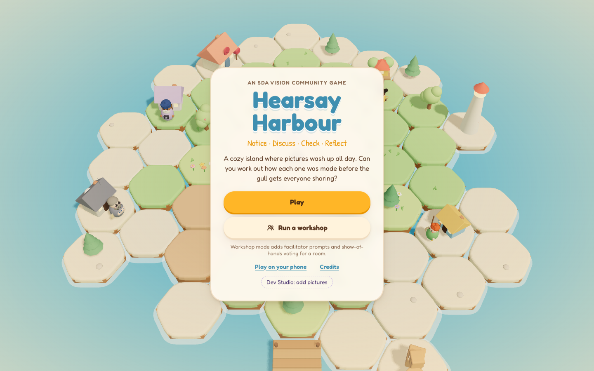
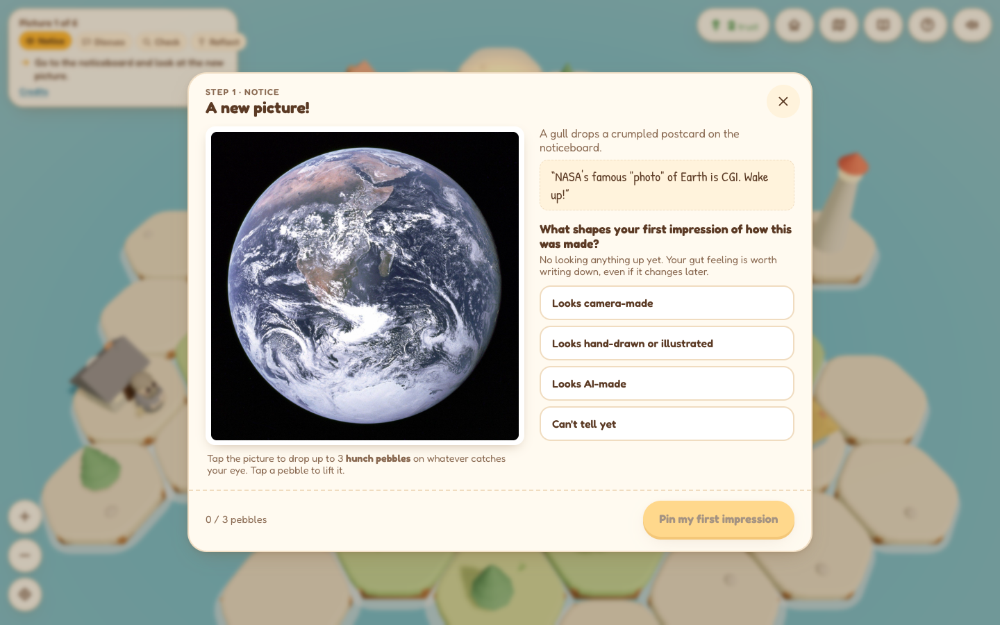
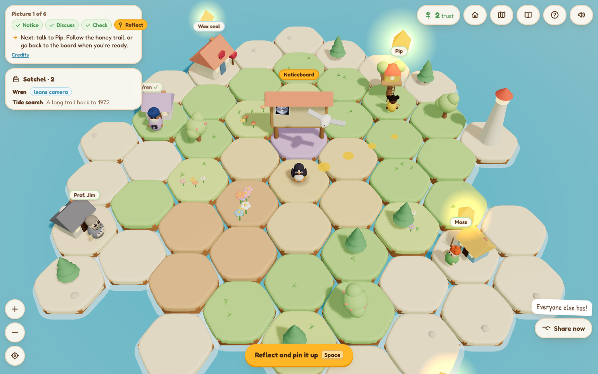
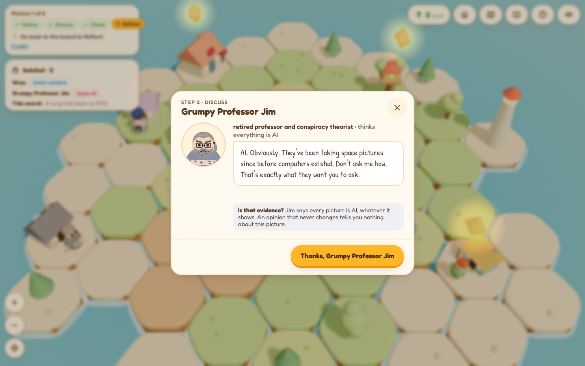
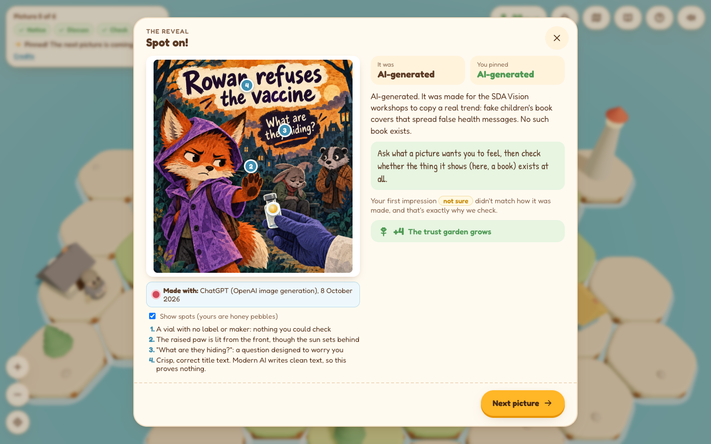
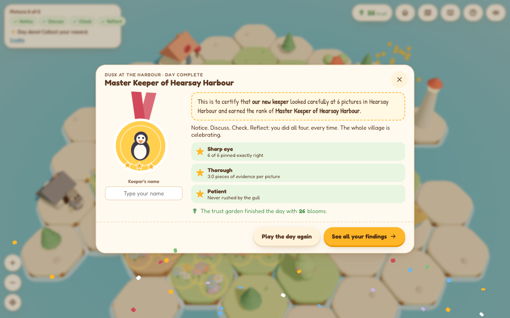
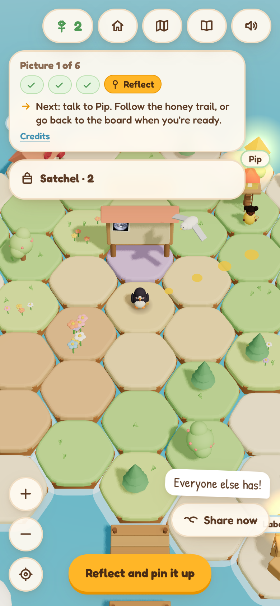

# Hearsay Harbour

[](https://doi.org/10.5281/zenodo.23237554)

**Play it in your browser:** https://intothedigital.github.io/hearsay-harbour/

Hearsay Harbour is a cozy island game about working out how a picture was made before you share it.
It teaches the SDA Vision community workshop method: **Notice → Discuss → Check → Reflect**. It can be
played alone, in a classroom, or run on a projector as a facilitated workshop.



## How it plays

You're a puffin, the new keeper of the village noticeboard. Pictures arrive all day by gull, bottle and
ferry, each with the caption it was shared with. For each picture you:

1. **Notice.** Drop up to three "hunch pebbles" on whatever catches your eye and record a first
   impression: camera-made, hand-drawn or illustrated, AI-made, or can't tell yet.
2. **Discuss.** Ask the villagers. They look for different things and often disagree, on purpose.
   - **Wren**, a Sikh elder and retired photographer, reads light, focus and lenses.
   - **Pip**, a sharp-eyed seven-year-old girl with a magnifying glass, spots text and small details.
   - **Moss**, a young fisher boy who hears all the harbour gossip, asks who shared it and why.
   - **Grumpy Professor Jim**, a retired professor and conspiracy theorist, says *every* picture is AI.
     The game points out that an opinion which never changes isn't evidence.
3. **Check.** Use the harbour's three tools, each a short minigame:
   - **Tide search** at the end of the pier: reverse image search.
   - **Wax seal** at the post office: content credentials (C2PA).
   - **Label crate** on the dock: file details (metadata).
4. **Reflect.** Back at the board, choose how it was made (camera-made, edited photo, hand-drawn or
   illustrated, AI-assisted, AI-generated, or still unsure) and how you'd describe it when sharing it.

The reveal shows how the picture was really made, its **credential** (what made it and who), the spots
worth noticing next to your own pebbles, and a lesson to carry forward.

| | |
|---|---|
|  |  |
|  |  |

### Trust, the Share gull and the reward

The **trust garden** by the noticeboard grows with careful answers: each point of trust is a cluster of
flowers, outlined in gold when it first appears, spreading across the island as the garden fills. An
honest "still unsure" after a proper look earns a bloom; a confident wrong answer wilts flowers, and
giving in to the **Share gull** (sharing a first impression without checking) costs the most.

When all six pictures are done, the village celebrates with fireworks and the player receives a
**reward**: a medal, a keeper's rank and up to three stars (Sharp eye, Thorough, Patient), with a
certificate to put their name on. The **recap** then lists every finding, awards keepsakes, offers
discussion prompts, and can be saved as an image or PDF.



### Finding your way

A five-page **welcome guide** opens at the start: where you are (with a labelled island map), the
mission, who to ask, the tools, and how to move around. Name tags float over every villager and tool;
a glowing **honey trail** and a **Next** button show where to go; and glowing diamonds mark places not
yet visited for the current picture. The **Home**, **map** and **guide** buttons are always at the top.

Tap or click to hop, drag to look around, scroll or pinch to zoom (or use the **+ − ◎** buttons, keys
`+`, `-`, `C`). Keys `Q W E A S D` or the arrows move the puffin and `Space` talks or uses. Progress is
saved in the browser, so a refresh or a trip to the Home screen doesn't lose the day.

## Workshop mode

Choose **Run a workshop** on the title screen to run the game for a room:

- A **facilitator panel** shows the prompt for each activity, following the SDA Vision facilitator guide.
- At **Notice** the room's show of hands uses the first-impression choices; at **Reflect** it uses the
  same "How was it made?" labels as the board.
- The reveal compares the room's first and final votes; the recap lists them for every picture, and the
  findings can be saved as an image or PDF, or copied as data (CSV) for research notes.
- The reward is shared: "Master Keepers of Hearsay Harbour", with a certificate for the group.

## Phones, tablets and installing

The game is responsive and works with touch. **Play on your phone** on the title screen shows a QR code
and the link. On a phone, *Add to Home Screen* (Safari's Share menu on iPhone and iPad, or Chrome's menu
on Android) installs it like an app: it opens full screen and keeps working offline once played.



## Running it locally

**On a Mac, double-click `Start Hearsay Harbour.command`.** It installs what it needs the first time,
starts the game and opens it in your browser. Close the Terminal window to stop it.

From a terminal (Node 22 or newer recommended; Node 20 works):

```bash
npm install
npm run dev          # http://localhost:3000
npm run generate     # static site in .output/public; runs from any folder or host
npm run validate     # checks every picture pack
npm run screenshots  # retakes the screenshots in docs/screenshots (needs npm run dev and Chrome)
```

Every push to `main` rebuilds the site and publishes it to GitHub Pages (`.github/workflows/pages.yml`).

## Levels and pictures

Each level is a **picture pack**: a JSON file in `app/packs/` (e.g. `level-1-harbour-basics.json`), with
image files in `public/pictures/`. For each picture a pack sets the caption it arrives with, how it was
really made, its credential, what each villager thinks, what each check finds, the spots revealed at the
end (as 0–1 positions on the image) and the closing lesson. When there's more than one pack, the title
screen lets players choose a level.

> The check results are **scripted for teaching**. They describe what a real check would typically
> find. Confirm them against your own searches before running a workshop.

### Adding pictures for new levels

1. Run `npm run dev` and choose **Dev Studio: add pictures** on the title screen (or copy images into
   `content-inbox/`). Record how each picture was really made, its credential, and where it came from.
2. Run the **`/import-pictures`** agent skill (`.claude/skills/import-pictures/SKILL.md`) in an AI coding
   agent that supports skills. One agent drafts each picture's villager lines, checks and spots; a
   second, independent agent reviews the draft against the picture and the notes. The import never
   guesses how a picture was made and never invents where it came from.
3. New entries arrive in the right level pack marked `"status": "draft"`. Play them, edit anything, then
   change the status to `"reviewed"`.

See `content-inbox/README.md` for the details.

### Do I need an API key?

No. Playing, running workshops, and building or editing picture packs by hand need no AI model,
account or key, and the repository contains no keys and makes no model calls.

The optional import step is an *agent skill*: a written set of instructions that an AI coding agent
follows, using whatever model and account that person already has (bring your own). Any agent that
supports skill files can run it, and the pack files can always be written by hand instead.

## Credits

An academic research project of **Synthetic Realities**, led by **Dr Sam Martin**, Smart Data Research UK
(UKRI) Fellow (Grant number UKRI4010), Manchester Metropolitan University (MMU).
ORCID: [0000-0002-4466-8374](https://orcid.org/0000-0002-4466-8374).
Part of [SDA Vision](https://github.com/Synthetic-Realities/sda-vision-source).

The look and feel, hex helpers and UI tokens are adapted from
[Hivebound](https://github.com/zernonia/hivebound) by zernonia (MIT, see `THIRD_PARTY.md`).
Every model and sound is made in code.

**Pictures (level 1)**
- Blue Marble: NASA / Apollo 17 crew, 1972, Hasselblad film camera (public domain).
- Cat in a hat: Adobe Firefly example from the [C2PA example assets](https://contentauth.github.io/example-assets/) (MIT).
- Rowan the fox cover: image generated using OpenAI’s image-generation tool in ChatGPT, 8 October 2026.
  Prompt developed collaboratively by Dr Sam Martin and ChatGPT.
  Reference: OpenAI (2026) *Rowan refuses the vaccine* [AI-generated illustration]. Generated using ChatGPT, 8 October.
- SDA comic: created by Dr Sam Martin for the SDA Vision workshops, using Google Gemini and OpenAI’s
  image-generation tool in ChatGPT.
- Window cat and washing machine: personal photos by Dr Sam Martin (real, unedited phone photos).

## Licence and citation

Code: [MIT](LICENSE). To cite Hearsay Harbour, use the DOI above, which always points to the latest
version (each release also has its own DOI on Zenodo), or [`CITATION.cff`](CITATION.cff)
(GitHub shows a "Cite this repository" button). `.zenodo.json` sets the metadata for Zenodo's GitHub
integration.
